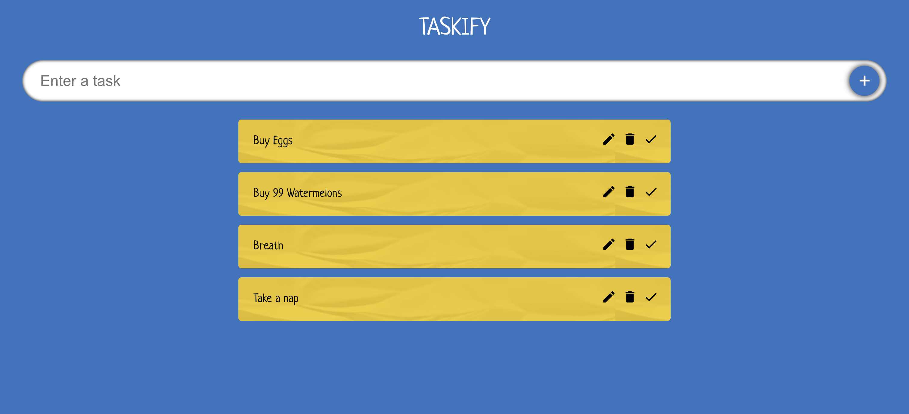
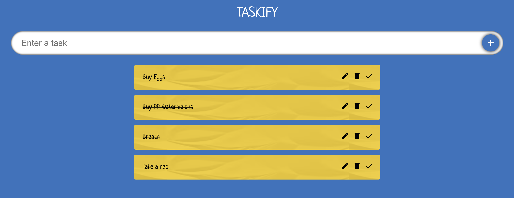

# Taskify

Todo List Application using TypeScript and Reactjs

## Features
* Can add todo
* Can delete Todo
* Can edit Todo
* Can mark if done

## Screenshots

Inspired from tutorial on <a href="https://youtu.be/FJDVKeh7RJI?si=ZqCjzQ_qyqa_c7Ok" target="_blank">Youtube Video</a>